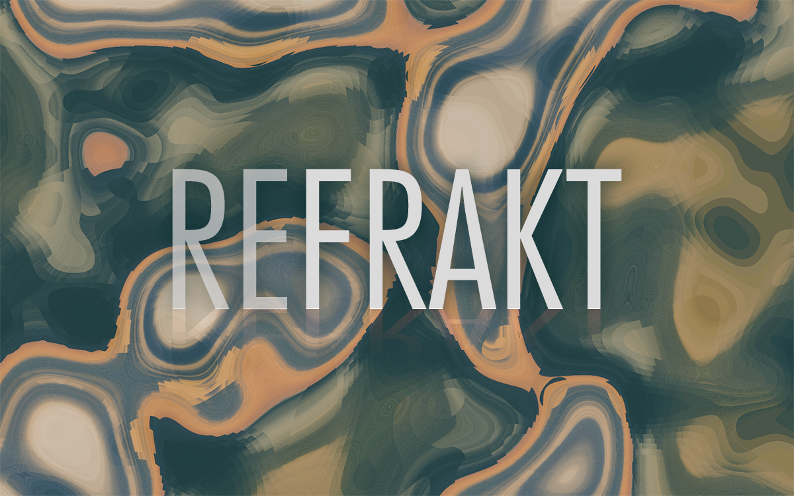

  

An exploration of a [generative art technique used by Kjetil Golid](https://twitter.com/kGolid/status/1091113662352379905), ported to React + TypeScript.

Given a two fractal noise fields (A and B) and a source image, generate a new image by mapping A(x, y) against the x axis of the image and B(x, y) against the y axis of the image. Or, roughly... `art[x][y] = image[A[x][y]][B[x][y]]`.

## Try it out

`npm install`

`npm start`

---

TODO:

- [ ] Choose output resolution from presets
- [ ] Choose noise generation from presets
- [ ] Choose source image
- [ ] Render noise fields
- [ ] Drag and drop source image
- [ ] Low-res previews
- [ ] Multiple input images and outputs
- [ ] Move noise generation to web worker
- [ ] (Experiment) move noise generation (all art generation?) to a shader

---

This project was bootstrapped with [Create React App](https://github.com/facebook/create-react-app).
